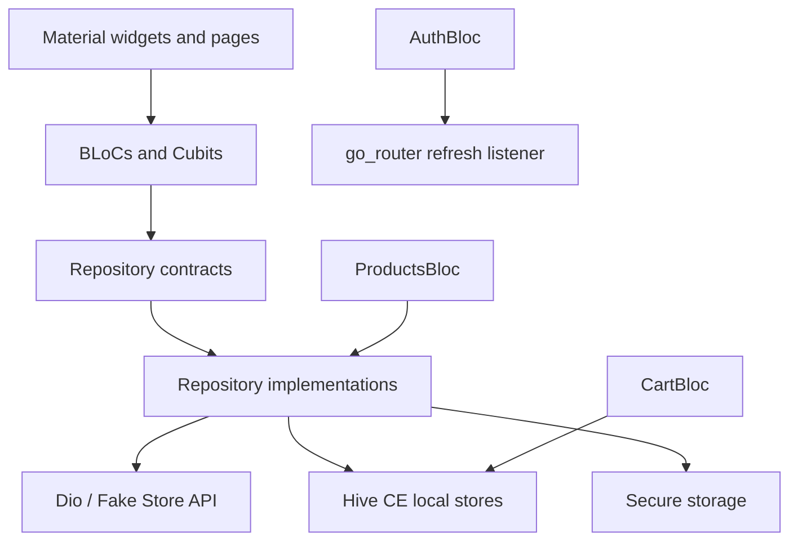

# Architecture

## Overview

LumaCart uses a pragmatic feature-first clean architecture. Each feature owns its domain models and repository contract, data implementation, BLoC or Cubit, and screens. Shared infrastructure remains in `core`, while app composition, theme, navigation, and dependency wiring remain in `app`.

## Dependency direction

Presentation depends on domain contracts and immutable state. Data implementations depend on domain contracts, Dio, and storage abstractions. Domain code does not import Flutter widgets, Dio, Hive, or secure storage. The app composition root constructs concrete dependencies and injects them through repository providers.

## State responsibilities

- `AuthBloc` restores, creates, and clears the active session and owns authentication transitions.
- `ProductsBloc` loads cache and remote catalog data, applies debounced search and category filters, and exposes stale-cache notices.
- `ProductDetailsCubit` loads one product and controls the details quantity selector.
- `CartBloc` is the single source of truth for the active cart and saved cart snapshots. Every meaningful mutation is persisted before a successful state is emitted.
- Pages contain view-only ephemeral state only when it is strictly local, such as form controllers and selected navigation tab.

## Remote and local source-of-truth rules

Remote product data is authoritative when available, with the last successful full catalog cached for offline use. The authenticated API token is stored securely. A local session record stores only safe profile metadata and a reference to account type.

Fake Store API user and cart writes are simulated. Local accounts therefore remain authoritative in Hive CE, and passwords are represented only by salted PBKDF2 hashes. The current cart and saved carts are always local-authoritative. Optional cart POST calls are informational and cannot determine whether a local save succeeds.

## Error handling

Dio errors and unexpected payloads are converted to typed `Failure` values. BLoCs expose user-safe messages and retry actions without leaking tokens, raw response bodies, or passwords. Cached catalog data can remain visible with a non-blocking offline warning. Corrupt local records are ignored or reset at the narrowest safe boundary.

## Navigation

`go_router` uses an authentication-aware refresh notifier. Public routes are splash, sign-in, and sign-up. Authenticated routes live in a four-branch `StatefulShellRoute.indexedStack`: Home, Cart, Saved Carts, and Profile. Product and saved-cart details are pushed above the shell. Redirects prevent protected-route access after logout and avoid sending authenticated users back to authentication pages.

## Dependency injection

Dependencies are constructed explicitly in `AppDependencies` and exposed with repository providers and BLoC providers. There is no global service locator. This keeps test replacement straightforward and avoids hiding object lifetimes.
